# Welcome to weHike

weHike is based on my finals project, weRun, for the Lighthouse Labs web development bootcamp.

Background: I worked on weRun with [Marianne](https://github.com/mariannebourcier) and together we created an amazing app that helped me learn so much along the process. Here is the original [repo](https://github.com/mariannebourcier/werun).

However, I wanted to add more features to the app and put my own little twist on it! My husband and I often go hiking with our dog and I thought it would be fun to change over this app to track hiking events instead of running events. It uses the same backend architecture from werun. 

This app uses React and Bootstrap on the front-end and Express, PostgreSQL and Node on the back-end. Multiple packages and APIS were used to make the user experience smoother, such as Recoil, Google Autocomplete and Google Maps. Twilio is currently being used to send users important information via text messaging.

### Live link: [weHike](https://wehike-app.netlify.app/)

### New features/bug fixes:
- The location selection for hikes autumatically calculates the distance between point A and point B. 
- A route is visible to the user prior to creating a new hike.
- Time for past hikes can now be recorded.

## App screenshots

1. This screenshot shows the homepage for weHike.
   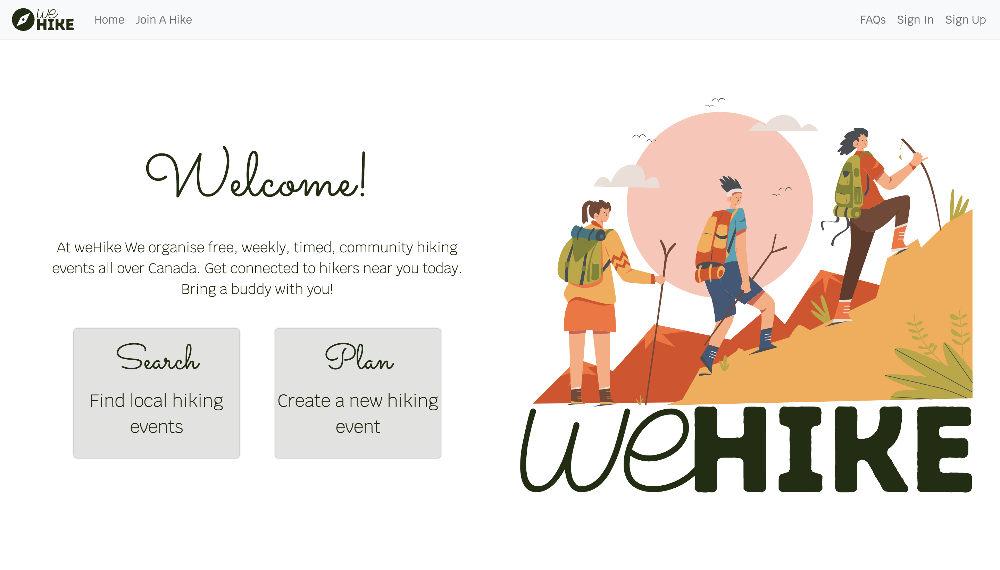

2. This screenshot shows a map that centers on the user's current location to allow them to find hiks near them more easily.
   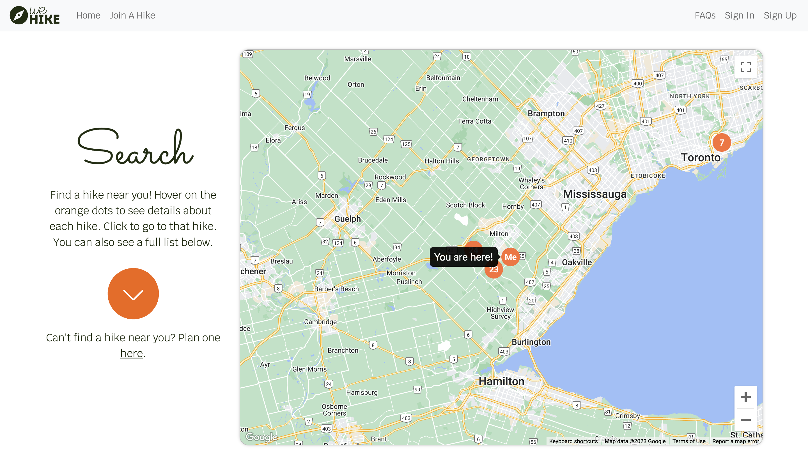

3. This screenshot shows the marker for a hike and details of the hike.

 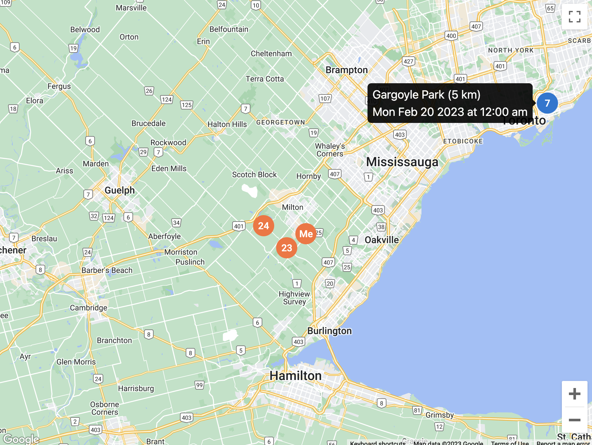

4. This screenshot shows what happens when a user hits the join button for a hike. The user will also receive a text message confirming their attendance to the event.
   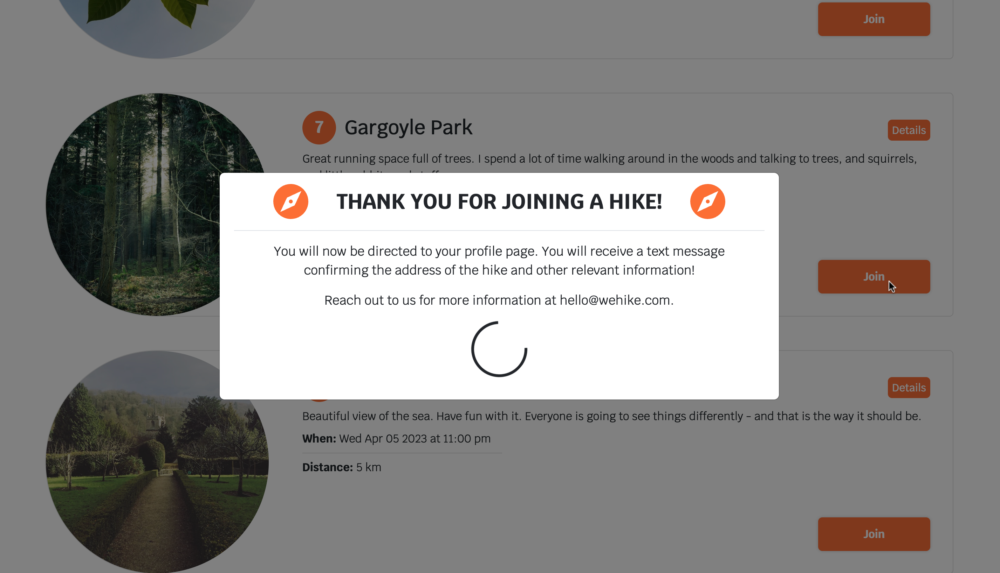

5. This screenshot shows which hikes are available to join.
   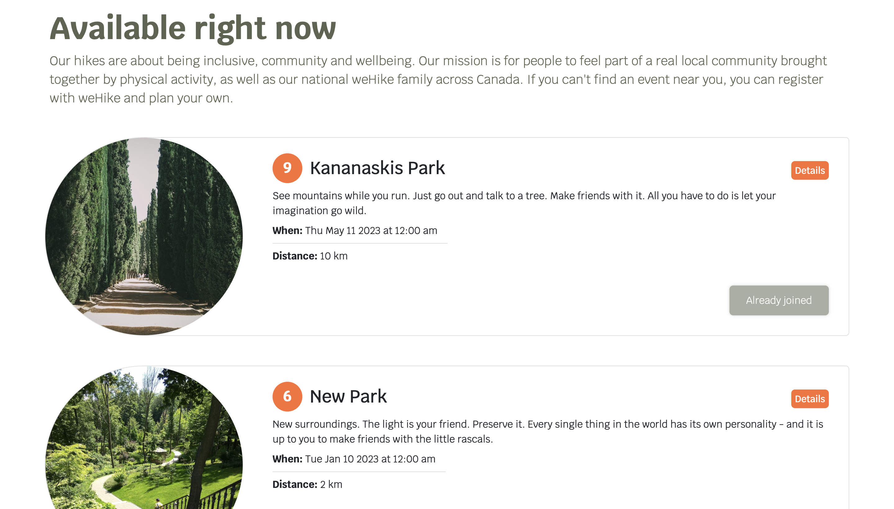

6. This screenshot shows the hike creation page where users can find the exact to and from location & distance for their hike.
   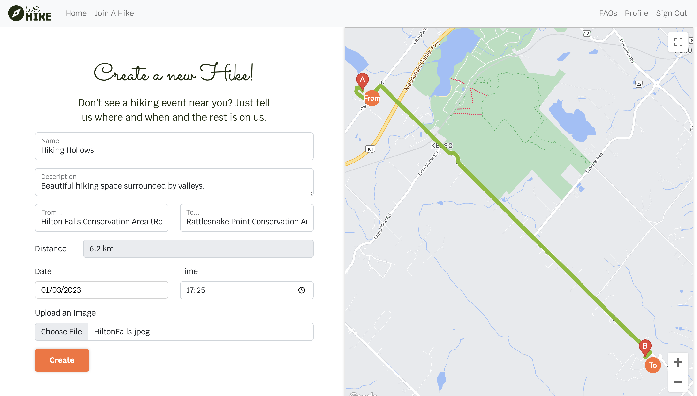

7. This screenshot shows the new hike that was created under the user's profile under the planned tab.
   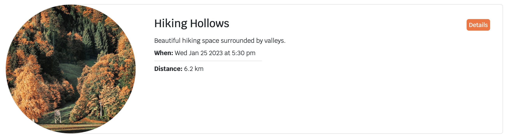

8. This screenshot shows the new hike's additional details such as the exact route, time and date.
   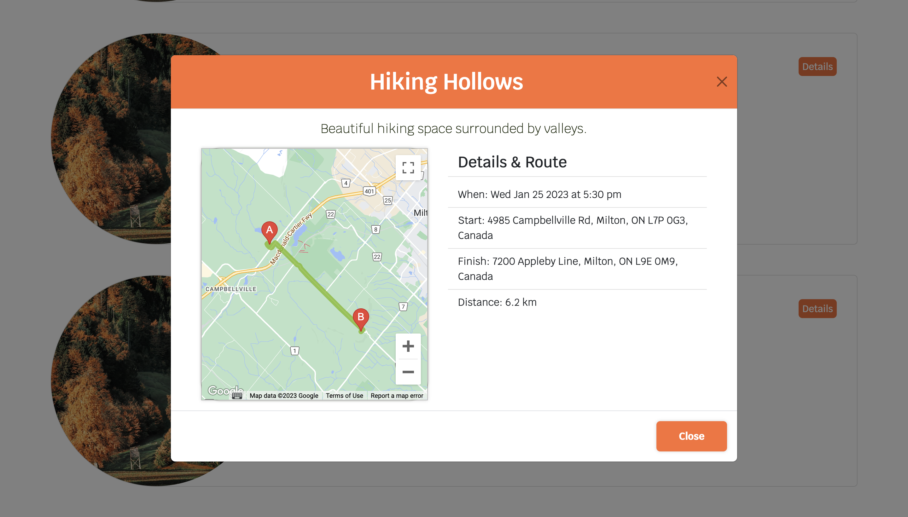

9. This screenshot shows the user's profile with their hiking statistics as well as a planned and attended tab for them to keep track of their events.
   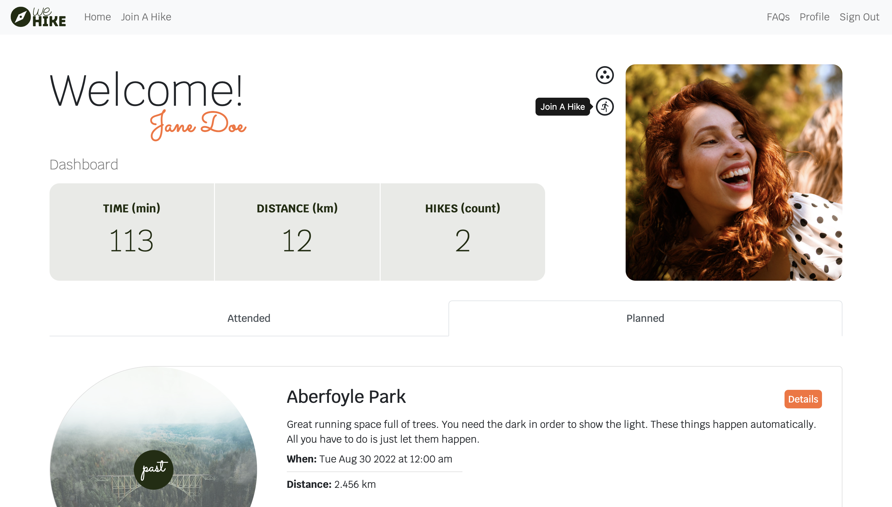

10. This screenshot shows the sign in page.

 
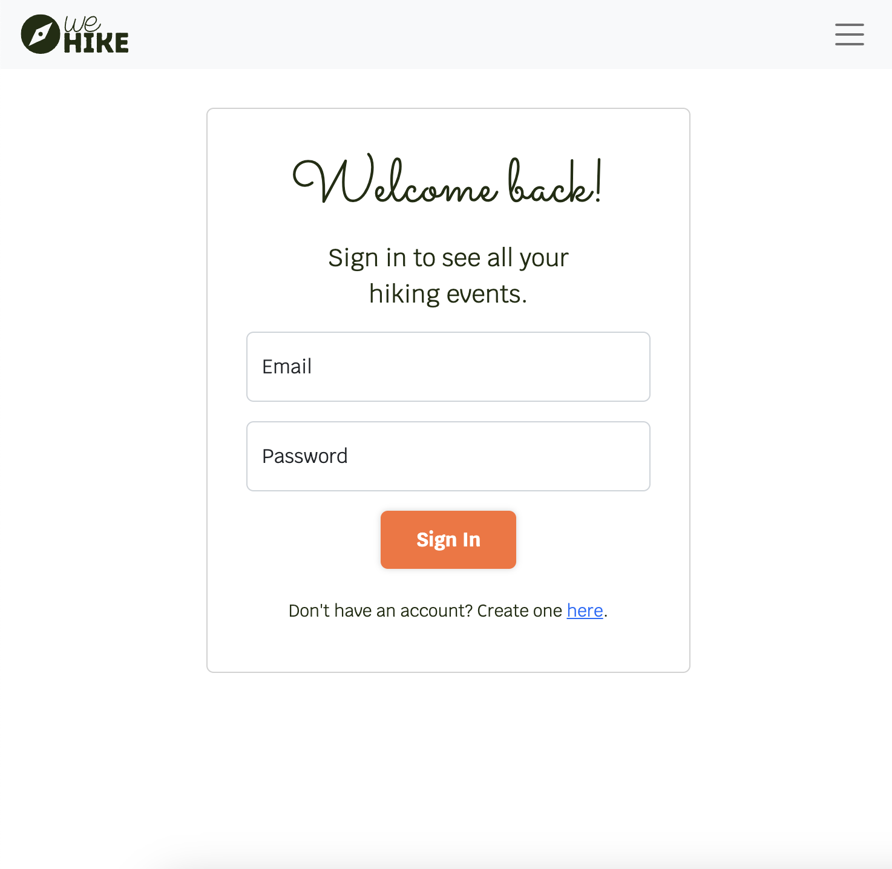 

11. This screenshot shows the sign up page.

 
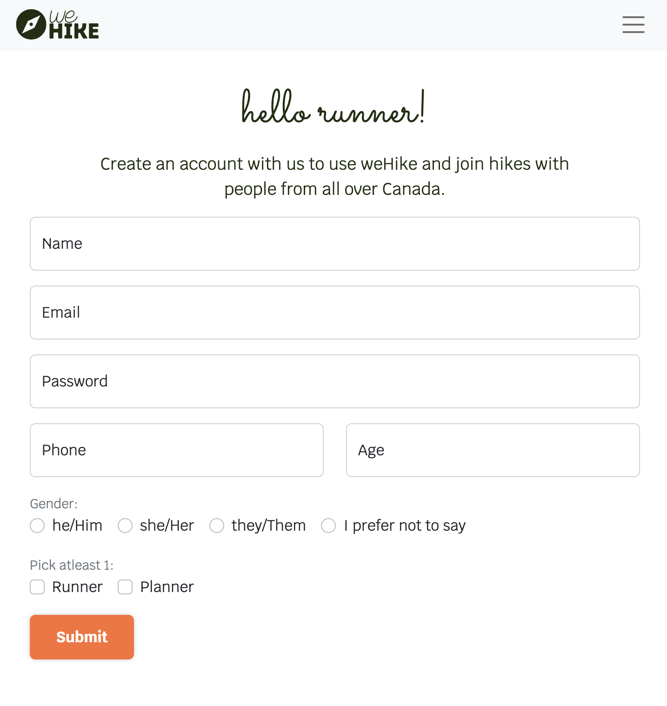 

## Tech Stack / Dependencies

### Front-End:

- axios
- bootstrap
- dotenv
- google-map-react
- react
- react-bootstrap
- react-datepicker
- react-dom
- react-router-dom
- react-scripts
- recoil
- recoil-persist

### Back-end: [link](https://github.com/sneham-boop/werun_heroku_server)

- bcryptjs
- body-parser
- cookie-session
- dotenv
- express
- nodemon
- pg
- twilio

## Getting Started

These instructions are for setting up a local PostgreSQL database. You will need to tweak the server routes and database files to be able to use your local database. 

The [live](https://wehike-app.netlify.app/) version of this app is hosted on Netlify and uses an API for a database on the Supabase platform and the server is hosted on heroku. Long story about how I ended up going this way. Needless to say, I'm still learning the most efficient ways to do this!

### Front-End:

1. `git clone` this project.
2. Install all dependencies using `npm install` in the terminal.
3. Type the `npm start` command.

### Back-end:

1. `git clone` the project at this [link](https://github.com/sneham-boop/werun_heroku_server).
2. Install all dependencies using `npm install` in the terminal.

#### A. Database:

1. Create a .env file in the root of the directory like the .env.example file and add your own database credentials for DB_USER, DB_PASS & DB_NAME
2. Next, we will need to create the database itself. Start PostgreSQL by using the `psql` command in your CLI.
3. Create the database using `CREATE DATABASE your-db-name;` command, but make sure to use the database name you used for the DB_NAME variable in the .env file.
4. Add tables to the database by typing `\i db/schema/01_schema.sql` in the terminal.
5. Add seed data to the database by typing `\i db/seeds/01_seeds.sql` in the terminal.

If the database credentials are setup properly, you should be able to connect to the db using `\c your-db-name`
The database must be initialized with new tables and some seed data next.

A few errors that can occur while setting up a PostgreSQL database:
Role mismatch: Check existing roles for your machine with `\du`. If your-role you used in the .env file does not exist, it will not show up and you will have to create one with the following command CREATE ROLE your-role WITH SUPERUSER;. Note that your current role must be superuser to be able to create a new role.
Password mismatch: Check how you have set up psql on your machine to sort this one.
Missing .env file: You need a .env file with your own credentials to be able to connect to the database. Use the .env.example file to create the .env file.

#### B. Server
Once the database is fully set up, type the `npm start` command.

### Future Features

- A button on the planner tab to notify runners of any changes related to the running event, such as cancelation or time change.
- A way for runners to record and track their time, possibly using an API from Fitbit, Strava or Apple Health.
- Allowing users to change their profile picture.

### Known Issues

- The profile picture is a static image from the server.
- This application hasn't been tested on other browsers besides Google Chrome yet.
